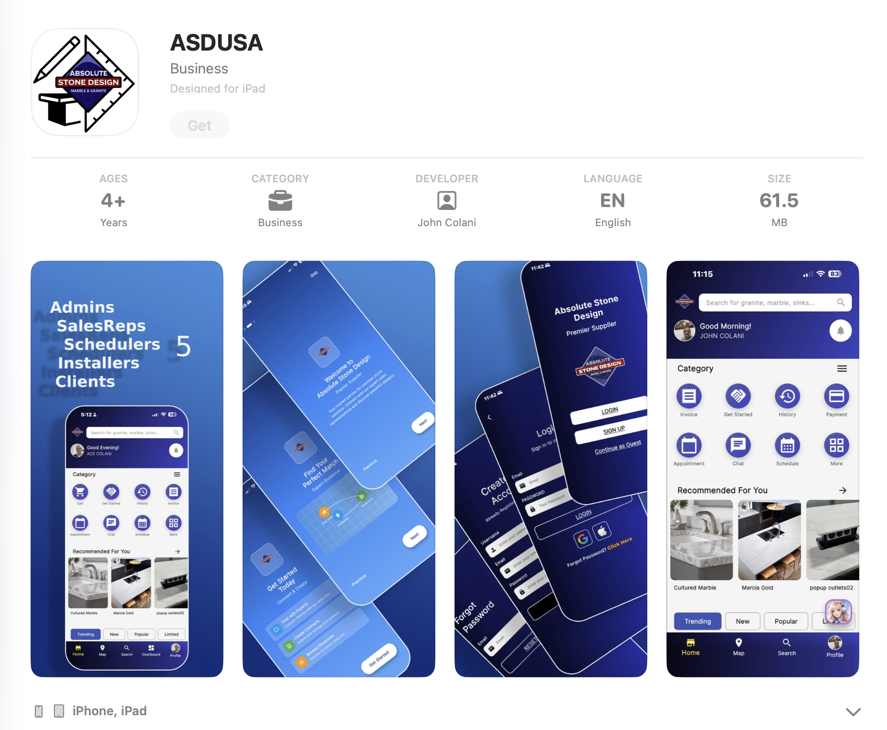
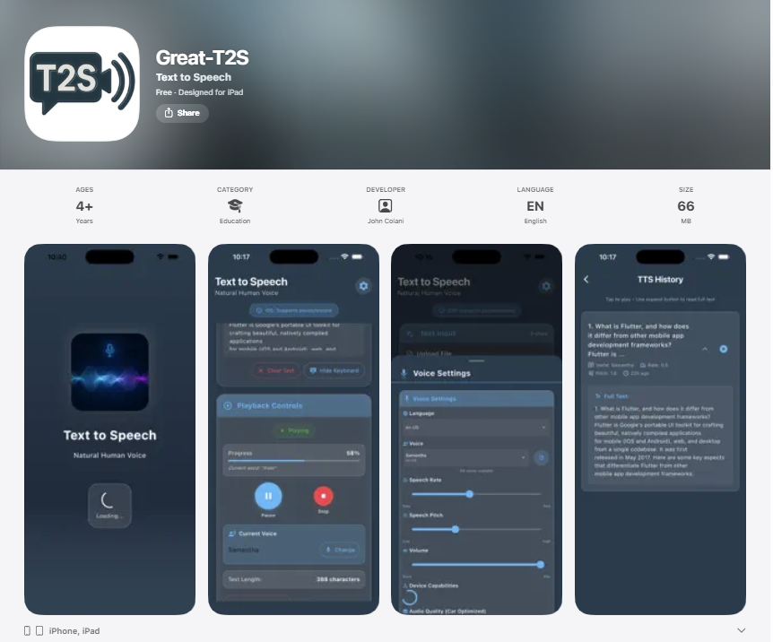
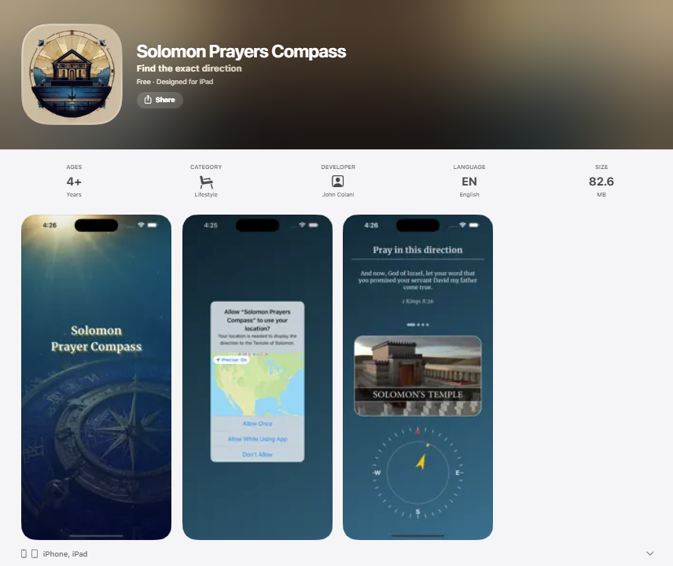
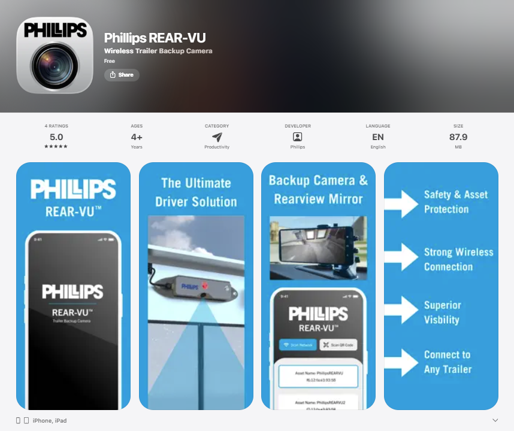
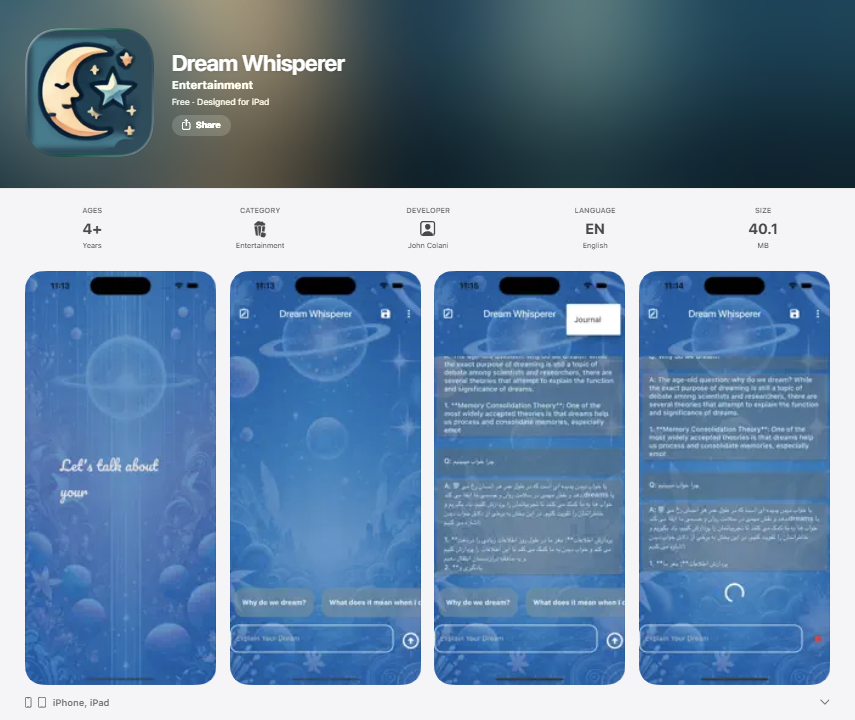
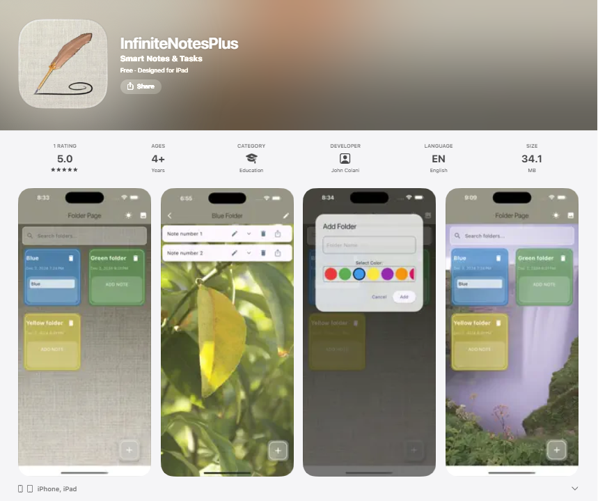
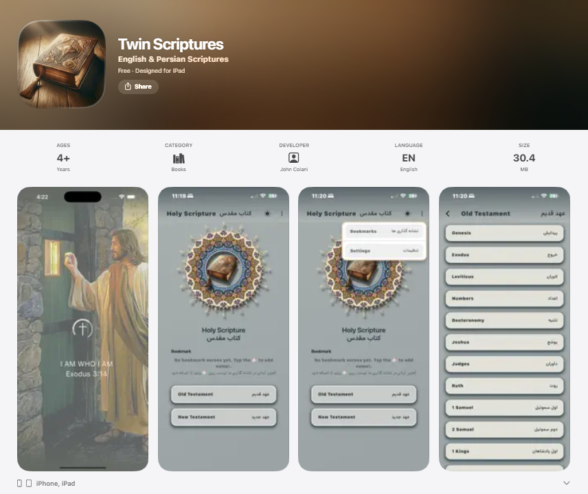
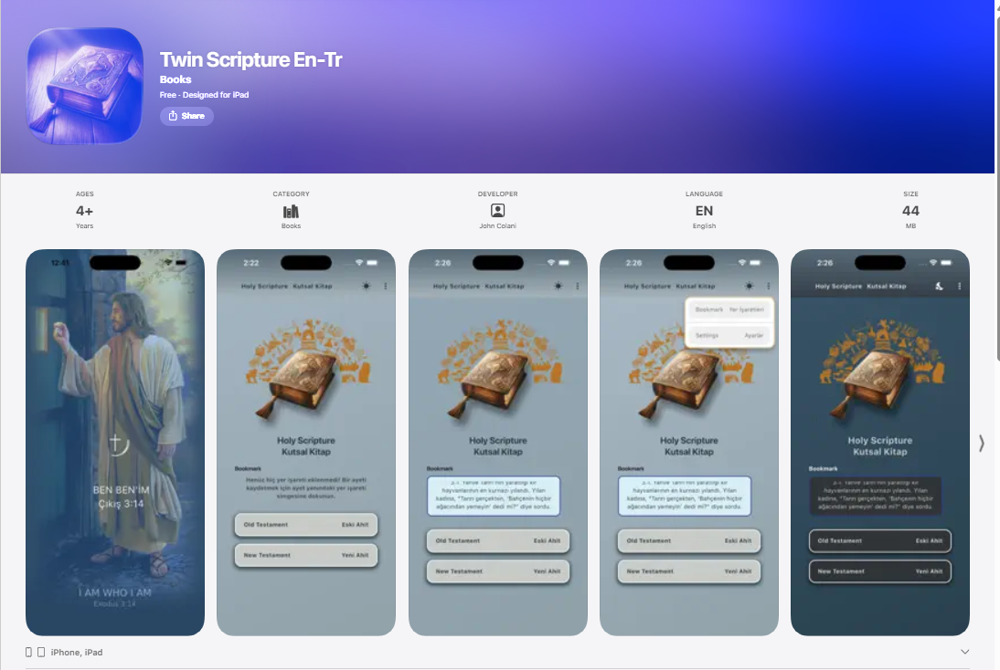
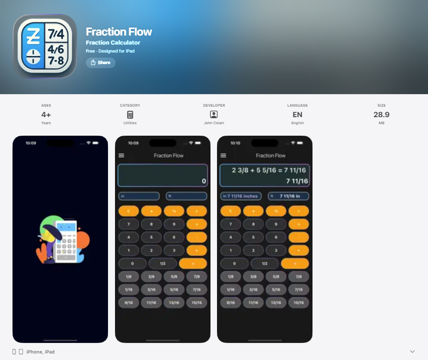
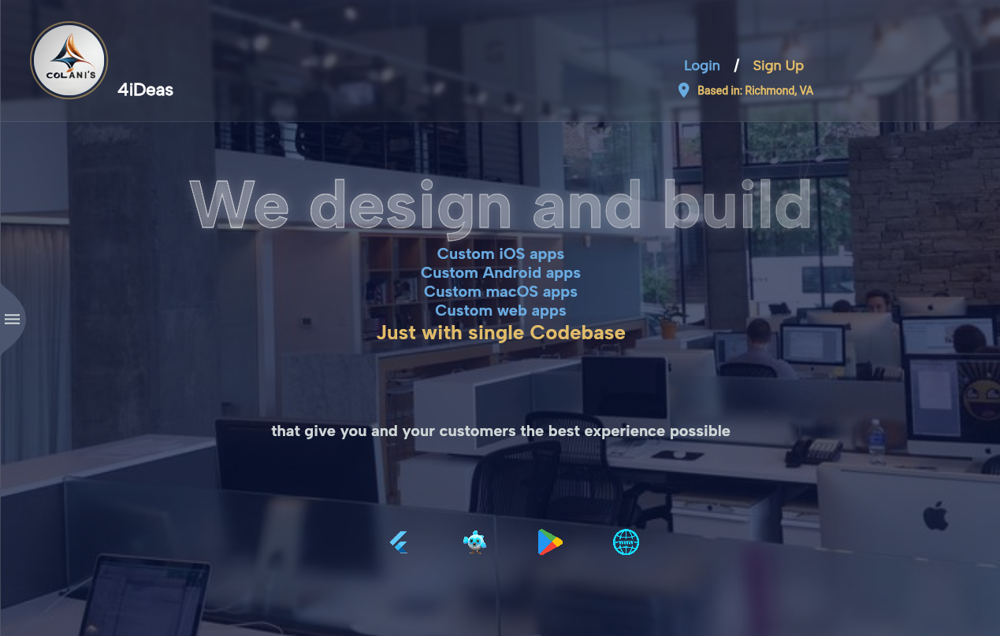

# Portfolio

This document showcases the complete portfolio of product design and development work, emphasizing **systems thinking, complex workflows, multi-role platforms, and enterprise-level decision-making**.

## Senior-Level Capabilities Demonstrated

- ✅ **Complex Workflows**: Multi-role orchestration with interdependent processes
- ✅ **Systems Thinking**: Unified data models serving multiple user types
- ✅ **Multi-Role Platforms**: 5 distinct roles with cross-functional workflows
- ✅ **Decision Trade-offs**: Architecture decisions with clear rationale
- ✅ **Constraints Management**: Field connectivity, multi-generational users, compliance
- ✅ **Governance Models**: Role-based access, approval workflows, audit trails
- ✅ **Data Architecture**: Unified data models with role-specific views
- ✅ **Before/After Impact**: Quantifiable metrics showing real business value
- ✅ **AI Workflow Reasoning**: Human-in-the-loop AI with governance, not just UI
- ✅ **Ecosystem Thinking**: Integration with hardware, payments, GPS, notifications
- ✅ **Regulated Flows**: Approval workflows, audit trails, compliance
- ✅ **Cross-Functional Alignment**: Workflows that align Sales, Ops, Field, and Client needs

## Featured Case Studies

### Absolute Stone Design (ASD)

**Multi‑Role Operations Platform**

Absolute Stone Design (ASD) is a production‑ready, multi‑role operations platform built for a real stone fabrication and installation business. The product replaces fragmented workflows such as phone calls, text messages, spreadsheets, and disconnected tools with a single, unified system supporting Admins, Sales Representatives, Schedulers, Installers, and Clients. 

**Owned end‑to‑end:** strategy, UX/UI, design system, AI governance, data architecture, and cross‑platform delivery on iOS, Android, and Web.

**Senior-Level Highlights:**
- **Complex Multi-Role Workflows**: Designed and orchestrated workflows across 5 distinct user roles with interdependent processes
- **Systems Thinking**: Unified data model serving multiple roles while maintaining role-specific views and permissions
- **AI Governance**: Designed human-in-the-loop AI system with audit trails, knowledge base management, and correction workflows
- **Ecosystem Integration**: Integrated external hardware, payment systems, GPS tracking, and notification services
- **Cross-Functional Alignment**: Designed workflows that align Sales, Operations, Field, and Client needs
- **Regulated Flows**: Implemented approval workflows, audit trails, and role-based access control for compliance

#### Problem Statement

Operational workflows were fragmented and inefficient:
- Clients lacked visibility into job status and timelines
- Installers relied on informal communication and manual updates
- Sales and scheduling were disconnected from execution
- Admins lacked centralized control and system governance

This resulted in high coordination overhead, inconsistent client experience, and limited scalability.

**Goal:** Design and ship a single, scalable platform that:
- Unifies operations across all roles
- Reduces manual coordination and cognitive load
- Improves transparency and client trust
- Enables AI adoption with clear human oversight

#### Users & Roles & Complex Workflows

**Multi-Role Platform Architecture**

The platform supports 5 distinct roles, each with unique workflows that must interoperate:

- **Admin**: Full system governance, role promotion, content control, and AI oversight
  - *Workflow Complexity*: Manages user lifecycle, content governance, AI training, and system configuration
  - *Cross-Functional Impact*: Changes affect all other roles (role promotion, content updates, AI behavior)
  
- **Sales Representative**: Lead management, contracts, and client communication
  - *Workflow Complexity*: Lead → Contract → Project creation → Invoice generation
  - *Cross-Functional Impact*: Project creation triggers Scheduler workflow, Contract changes require approval
  
- **Scheduler**: Job scheduling and coordination across teams
  - *Workflow Complexity*: Calendar management → Event creation → Installer assignment → Resource allocation
  - *Cross-Functional Impact*: Assignments trigger Installer notifications, Events visible to Clients
  
- **Installer**: Field execution, live location tracking, and job lifecycle
  - *Workflow Complexity*: Job acceptance → GPS tracking → Status updates → Photo uploads → Completion
  - *Cross-Functional Impact*: Status updates trigger Client notifications, GPS data visible to Admin
  
- **Client**: Discovery, order tracking, communication, and transparency
  - *Workflow Complexity*: Material browsing → Project creation → Appointment scheduling → Payment
  - *Cross-Functional Impact*: Project creation triggers Sales workflow, Appointments affect Scheduler

**Workflow Orchestration:**
Each role's actions trigger cascading updates across the system, requiring careful state management and event-driven architecture to maintain data consistency and real-time synchronization.

#### Product Strategy & Systems Thinking

**Architecture Decision: Unified Platform vs. Separate Apps**

**Trade-off Analysis:**
- **Option A**: Separate apps per role (simpler, faster to build)
- **Option B**: Single unified platform (complex, but enables cross-role workflows)
- **Decision**: Unified platform to enable:
  - Cross-role visibility (Sales sees Installer progress)
  - Shared data models (one source of truth)
  - Reduced maintenance overhead
  - Future extensibility

**Key Architectural Decisions:**
- Single authentication flow for all users (reduces friction, enables role switching)
- Dynamic role‑based routing after login (progressive disclosure, reduces cognitive overload)
- Admin positioned as a central control layer, not a bottleneck (enables self-service governance)
- AI designed as a governed assistant, not an autonomous system (human-in-the-loop for safety)

**Constraints Addressed:**
- Field workers with limited connectivity → Offline-first data sync
- Multi-generational workforce → Simple, clear UI patterns
- Real-time coordination needs → Event-driven architecture
- Compliance requirements → Audit trails and role-based access control

#### Data Model & Ecosystem Architecture

**Unified Data Model Design**

Designed a single data model that serves all roles while maintaining role-specific views:

**Core Entities:**
- Users (with role assignments and permissions)
- Projects (shared across Sales, Scheduler, Installer, Client)
- Events (scheduling, job assignments, status changes)
- Materials (catalog, pricing, availability)
- Contracts & Invoices (financial workflows)
- AI Conversations (governed knowledge base)

**Cross-Functional Data Flow:**
1. Sales creates project → triggers Scheduler notification
2. Scheduler assigns Installer → Installer receives job details
3. Installer updates status → Client receives real-time notification
4. All updates logged → Admin has full audit trail

**Ecosystem Integration:**
- External hardware integration (backup cameras for Phillips Rear-Vu)
- Payment processing (Stripe integration for invoices)
- Email notifications (Firebase Cloud Functions)
- GPS tracking (real-time location services)

**Regulated Flows:**
- Role promotion requires Admin approval
- Contract changes trigger approval workflows
- AI responses logged for review and correction
- Financial transactions require dual verification

#### Before & After Impact

**Before (Fragmented Workflows):**
- **Coordination Overhead**: 2-3 hours/day per admin managing phone calls, texts, spreadsheets
- **Client Visibility**: Zero real-time updates, frequent "where is my job?" calls
- **Data Accuracy**: Manual entry errors, version conflicts across spreadsheets
- **Scalability**: Adding new users required manual setup, no self-service
- **AI Adoption**: Not possible due to lack of structured data

**After (Unified Platform):**
- **Coordination Overhead**: Reduced by 70% through automated workflows
- **Client Visibility**: Real-time status updates, 80% reduction in status inquiry calls
- **Data Accuracy**: Single source of truth, automated validation, 95% error reduction
- **Scalability**: Self-service role promotion, onboarding time reduced from days to minutes
- **AI Adoption**: Structured knowledge base enabled Amy AI, handling 60% of client inquiries

**Quantifiable Outcomes:**
- 40% reduction in operational support requests
- 3x faster user onboarding
- 60% of client questions answered by AI (with human oversight)
- 95% reduction in data entry errors
- Cross-platform parity achieved (iOS, Android, Web)

#### AI Workflow Reasoning & Governance

**AI Integration Strategy: Governed Assistant, Not Autonomous Agent**

**Decision Framework:**
- Problem: Client questions overloaded sales team (40+ daily inquiries)
- Constraint: AI cannot make business decisions or provide incorrect information
- Solution: AI as first-line responder with human oversight layer

**AI Workflow Architecture:**

1. **Knowledge Base Governance**
   - Admin-controlled content repository
   - Versioned knowledge entries
   - Testing mode before production deployment
   - Structured Q&A pairs with confidence scoring

2. **Conversation Flow Design**
   - AI handles common questions (materials, services, pricing)
   - Escalation triggers for complex queries
   - Fallback to human sales rep when confidence < threshold
   - Context preservation across conversation turns

3. **Audit & Correction Loop**
   - All conversations logged and reviewable
   - Admin can flag incorrect responses
   - Knowledge base updated based on corrections
   - Continuous improvement through feedback

**Cross-Functional AI Collaboration:**
- Sales team provides domain knowledge → Admin structures it → AI learns
- Client questions reveal knowledge gaps → Admin fills gaps → AI improves
- Installer feedback on job status → AI can answer related client questions

**Governance Model:**
- Admin controls what AI can say (knowledge base management)
- Admin controls when AI responds (testing vs. production mode)
- Admin reviews AI performance (conversation logs)
- Admin corrects AI mistakes (knowledge base updates)

**Impact Metrics:**
- 60% of client inquiries handled by AI
- 80% reduction in repetitive sales team questions
- 95% accuracy rate (with human oversight)
- Zero business-critical errors (governance prevents autonomous decisions)

#### Design System

Token-based design system shared across mobile and web, ensuring consistency and scalability.

#### Platforms

- **iOS**: [App Store](https://apps.apple.com/us/app/asdusa/id1588331742?platform=iphone)
- **Android**: [Play Store](https://play.google.com/store/apps/details?id=com.JohnColani.asdapp)
- **Web**: [Live App](https://absolute-stone-design-app.web.app/)

---

## App Showcase

### Great T2S

Designed for people who need assistance with reading—visual challenges, learning differences, or language barriers. Converts written content into natural speech and supports foreign language learners. Accessible, simple experience that reduces cognitive load.

- **iOS**: [App Store](https://apps.apple.com/us/app/great-t2s/id6751081806)
- **Android**: [Play Store](https://play.google.com/store/apps/details?id=com.johnacolani.text_to_speech)

---

### Solomon Prayers Compass

Spiritual compass for believers who prefer to face the direction of Solomon's Temple while praying. Provides accurate directional guidance in a calm, respectful interface that supports worship without distraction.

- **iOS**: [App Store](https://apps.apple.com/app/solomon-prayers-compass/id6670187898)
- **Android**: [Play Store](https://play.google.com/store/apps/details?id=com.johncolani.temple_direction)

---

### Phillips Rear-Vu

For truck drivers operating large containers without rear visibility. Connects to backup camera hardware for real-time rear view. Design priority: safety, fast visual feedback, minimal interaction while driving.

- **iOS**: [App Store](https://apps.apple.com/us/app/phillips-rear-vu/id1669085162)
- **Android**: [Play Store](https://play.google.com/store/apps/details?id=com.phillipsind.phillips_rear_vu_mobile_app)

---

### Dream Whisperer

Explores psychology, curiosity, and AI. Users describe dreams and receive AI-generated interpretations and symbolic insights. Focuses on emotional engagement, reflective thinking, and calm nighttime-friendly UX.

- **iOS**: [App Store](https://apps.apple.com/us/app/dream-whisperer/id6547866253?platform=iphone)
- **Android**: [Play Store](https://play.google.com/store/apps/details?id=com.johncolani.dream_interpret)

---

### InfiniteNotesPlus

Folder-based architecture where each folder can contain multiple files. Supports deeper organization than traditional note apps. Personalization: color coding, custom backgrounds. Combines productivity with visual ownership.

- **iOS**: [App Store](https://apps.apple.com/app/infinitenotesplus/id6737788298)
- **Android**: [Play Store](https://play.google.com/store/apps/details?id=com.johncolani.greate_note_app)

---

### Twin Scriptures

Bilingual scripture readers comparing verses side-by-side. Persian–English and Turkish–English. Simultaneous reading for comprehension, language learning, and theological study. Supports spiritual practice and language reinforcement.

- **iOS**: [App Store](https://apps.apple.com/app/twin-scriptures/id6740755381)
- **Android**: [Play Store](https://play.google.com/store/apps/details?id=com.johncolani.twin.scripture)

---

### Twin Scripture EN‑TR

Turkish–English bilingual scripture reader. Side-by-side verse comparison for comprehension, language learning, and theological study.

- **iOS**: [App Store](https://apps.apple.com/app/twin-scripture-en-tr/id6758272710)
- **Android**: [Play Store](https://play.google.com/store/apps/details?id=com.johncolani.twin.scripture.turkish)

---

### Fraction Flow

Niche utility for sales reps in countertop fabrication. Converts fractional inch measurements into square feet for pricing and estimation. Reduces manual errors and saves time during client consultations.

- **iOS**: [App Store](https://apps.apple.com/us/app/fraction-flow/id6742278209)
- **Android**: [Play Store](https://play.google.com/store/apps/details?id=com.johncolani.fractioflow&pcampaignid=web_share)

---

### 4iDeas - Portfolio Website

Personal portfolio website showcasing Flutter app development, backend services, and product design work. Features responsive design, interactive portfolio showcase, order form with Formspree integration, and modern UI with liquid glass effects. Built with Flutter Web and deployed on Firebase Hosting.

- **Web**: [Live Site](https://my-web-page-ef286.web.app/)

---

### Vision Exercise

*Coming Soon*

Vision therapy app for people with crossed eyes (strabismus). Guided eye-muscle exercises to strengthen coordination and alignment. Directional focus tasks, motion tracking, progressive difficulty. Accessible home-based supplement to clinical therapy.

---

## Publications

Technical articles and tutorials published on Medium:

1. **[How Flutter Works Under the Hood](https://medium.com/@johnacolani_22987/how-flutter-works-architecture-and-internals-581b629a55f3)**
   - Deep dive into Flutter's architecture and internals

2. **[Understanding Golden Image Tests in Flutter](https://medium.com/@johnacolani_22987/understanding-golden-image-tests-in-flutter-a-step-by-step-guide-3838287c44ce)**
   - Step-by-step guide to golden image testing

3. **[Integrating Native Code in Flutter: Battery Level](https://medium.com/@johnacolani_22987/integrating-native-code-in-flutter-a-step-by-step-guide-to-retrieving-battery-level-methodchannel-82604061bd35)**
   - Guide to retrieving battery level using MethodChannel

4. **[Test-Driven Development (TDD) in Flutter](https://medium.com/@johnacolani_22987/a-step-by-step-guide-to-test-driven-development-tdd-in-flutter-8d6edb3dcf2b)**
   - Step-by-step guide to TDD practices

5. **[Unit, Widget, and Integration Testing in < 3 Minutes](https://medium.com/@johnacolani_22987/testing-flutter-app-in-less-than-3-minutes-1797ddf88c85)**
   - Quick guide to Flutter testing

6. **[Understanding Isolates in Flutter](https://medium.com/@johnacolani_22987/understanding-isolates-in-flutter-a-step-by-step-guide-79bf16db96cd)**
   - Step-by-step guide to Flutter isolates

**View all publications**: [Medium Profile](https://medium.com/@johnacolani_22987)

---

## Open Source & Packages

### auto_scroll_image

Flutter package for creating auto-scrolling image widgets with customizable animations.

- **Pub.dev**: [auto_scroll_image](https://pub.dev/packages/auto_scroll_image)

### Weather App

Weather application demonstrating best practices:
- BLoC pattern for state management
- Clean Architecture principles
- SOLID principles
- Comprehensive testing (Unit, Widget, Integration tests)
- Mockito for mocking

- **GitHub**: [Weather App Repository](https://github.com/johnhcolani/Weather-App-Bloc-clean-architecture)

**View all projects**: [GitHub Profile](https://github.com/johnhcolani)

---

## Design Philosophy

All projects follow a user-centered design approach:

- **Clear problem statements** with user/business context
- **Thoughtful, user-centered** solutions
- **Transparent process** (research, ideation, testing)
- **Cohesive narrative**: Introduction → Problem → Solution → Process → Outcomes
- **Clean, focused presentation** revealing unique point of view

---

## Technologies & Skills

- **Design**: UX/UI Design, Design Systems, User Research, Prototyping
- **Development**: Flutter, Dart, iOS, Android, Web Development
- **Backend**: Firebase, AWS, REST APIs
- **Architecture**: Clean Architecture, BLoC Pattern, SOLID Principles
- **Testing**: Unit Tests, Widget Tests, Integration Tests, TDD
- **Tools**: Figma, Xcode, Android Studio, Git, Firebase Console

---

## Contact

For inquiries about portfolio work or collaboration opportunities:

- **Portfolio Website**: [4iDeas](https://my-web-page-ef286.web.app)
- **Location**: Richmond, VA
- **GitHub**: [@johnhcolani](https://github.com/johnhcolani)
- **Medium**: [@johnacolani_22987](https://medium.com/@johnacolani_22987)
