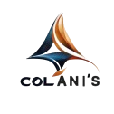

# 4iDeas - Product Design & Development Portfolio

A cross-platform Flutter application showcasing product design and development work across iOS, Android, macOS, Web, and Windows platforms.



## 🚀 Features

- **Cross-Platform Support**: Single codebase for iOS, Android, macOS, Web, and Windows
- **Portfolio Showcase**: Interactive portfolio with case studies, app showcases, and publications
- **User Authentication**: Firebase-based authentication with email/password, Google Sign-In, and Apple Sign-In
- **Order Management**: Full order management system with admin capabilities
- **Responsive Design**: Beautiful, responsive UI that adapts to different screen sizes
- **Modern UI/UX**: Glassmorphism effects, smooth animations, and intuitive navigation

## 📱 Screenshots

### Home Screen


### Portfolio

For detailed portfolio information including apps, case studies, publications, and open source projects, see **[PORTFOLIO.md](PORTFOLIO.md)**.

**Portfolio Highlights - Senior-Level Capabilities:**
- **Complex Multi-Role Workflows** - Orchestrated workflows across 5 distinct user roles
- **Systems Thinking** - Unified data models serving multiple roles with role-specific views
- **AI Governance** - Human-in-the-loop AI with audit trails and knowledge base management
- **Ecosystem Integration** - Hardware, payments, GPS, and notification integrations
- **Cross-Functional Alignment** - Workflows aligning Sales, Operations, Field, and Client needs
- **Before/After Impact** - Quantifiable metrics: 70% reduction in coordination overhead, 95% error reduction

**Quick Overview:**
- **10+ Mobile & Web Apps** - Published on App Store, Play Store, and Web
- **Featured Case Study** - Absolute Stone Design (ASD) multi-role platform with detailed systems thinking
- **6 Technical Publications** - Medium articles on Flutter development
- **Open Source Projects** - Packages and repositories on GitHub and Pub.dev


## 🛠️ Tech Stack

- **Framework**: Flutter
- **State Management**: BLoC (flutter_bloc)
- **Backend**: Firebase (Authentication, Firestore)
- **Architecture**: Clean Architecture with Domain-Driven Design
- **UI Components**: Custom widgets with glassmorphism effects
- **Fonts**: Google Fonts (Albert Sans)
- **Icons**: Material Icons

## 📦 Dependencies

Key dependencies include:
- `firebase_core` & `firebase_auth` - Authentication
- `cloud_firestore` - Database
- `flutter_bloc` - State management
- `google_fonts` - Typography
- `url_launcher` - External links
- `webview_flutter` - In-app web views
- `google_sign_in` & `sign_in_with_apple` - Social authentication

## 🚀 Getting Started

### Prerequisites

- Flutter SDK (latest stable version)
- Dart SDK
- Firebase account and project setup
- Platform-specific requirements:
  - **iOS**: Xcode and CocoaPods
  - **Android**: Android Studio and Android SDK
  - **Web**: Chrome or any modern browser
  - **macOS**: Xcode
  - **Windows**: Visual Studio with C++ tools

### Installation

1. Clone the repository:
```bash
git clone https://github.com/johnhcolani/MyWebSite.git
cd MyWebSite
```

2. Install dependencies:
```bash
flutter pub get
```

3. Configure Firebase:
   - Add your `google-services.json` (Android) to `android/app/`
   - Add your `GoogleService-Info.plist` (iOS) to `ios/Runner/`
   - Update `lib/firebase_options.dart` with your Firebase configuration

4. Run the app:
```bash
# For web
flutter run -d chrome

# For Android
flutter run -d android

# For iOS
flutter run -d ios
```

## 🌐 Deployment

### Web Deployment (Firebase Hosting)

1. Build the web app:
```bash
flutter build web --release
```

2. Deploy to Firebase:
```bash
firebase deploy --only hosting
```

Your app will be live at:
- `https://my-web-page-ef286.web.app`
- `https://my-web-page-ef286.firebaseapp.com`

## 📱 Platform Support

- ✅ **iOS** - Full support with App Store deployment
- ✅ **Android** - Full support with Play Store deployment
- ✅ **Web** - Responsive web application
- ✅ **macOS** - Native macOS application
- ✅ **Windows** - Native Windows application

## 🎨 Design Features

- **Glassmorphism UI**: Modern glass-like effects with backdrop filters
- **Smooth Animations**: Custom animations and transitions
- **Responsive Layout**: Adapts to mobile, tablet, and desktop screens
- **Dark Theme**: Beautiful dark theme with orange and blue accents
- **Custom Drawer**: Sliding menu with smooth animations

## 📚 Project Structure

```
lib/
├── core/              # Core utilities and widgets
├── features/          # Feature modules
│   ├── auth/         # Authentication feature
│   ├── portfolio/    # Portfolio feature
│   └── contract/     # Contract management
├── screens/           # Main screens
├── helper/           # Helper utilities
├── data/             # Data models and repositories
└── services/         # Business logic services
```

## 🔐 Authentication

The app supports multiple authentication methods:
- Email/Password authentication
- Google Sign-In
- Apple Sign-In
- Email verification

## 📝 License

This project is private and proprietary.

## 👤 Author

**John Colani**
- Portfolio: [4iDeas](https://my-web-page-ef286.web.app)
- Email: Contact through the app
- Location: Richmond, VA

## 🙏 Acknowledgments

Built with Flutter and Firebase, showcasing modern cross-platform development practices.

---

**Note**: This is a portfolio application demonstrating product design and development capabilities across multiple platforms.
